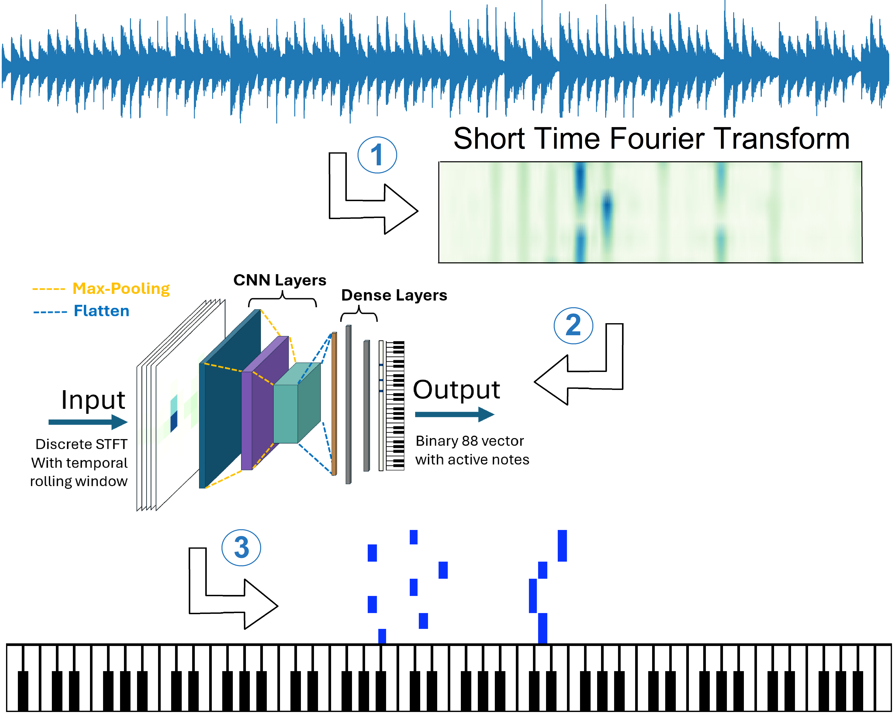
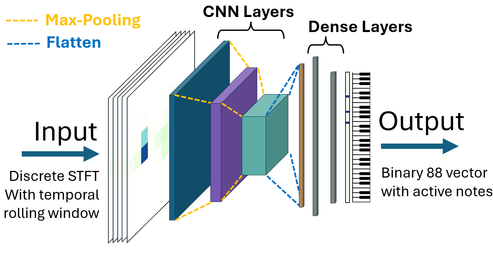
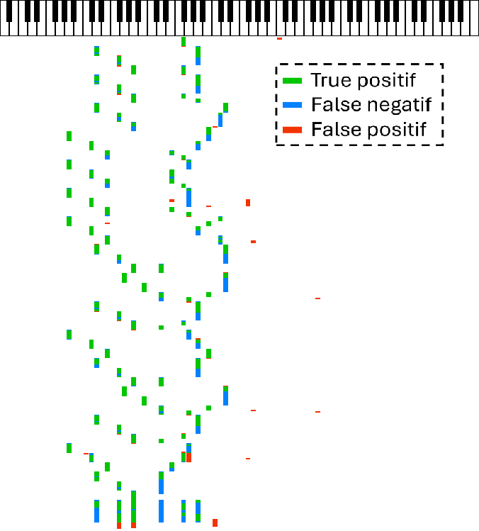

# Piano Automatic Transcription : From mp3 sound to notes partitionPiano music

This project aims to explore the ways to convert mp3 solo music into midi file (which can be converted into music partition sheets with traditional softwares).

---
# What it is doing :

## 1. Creation and augmentation of the dataset
I used in this project a dataset of simple piano songs which can be found on .
The dataset is augmented by shifting the songs toward higher or lower octaves.

I used the  package to load and handle the midi files.

## 2. Convertion of the time series into the frequential domain using Short Time Fourier Transform (STFT)
I used `scipy.signal.ShortTimeFFT` to compute the STFTs.

## 3. Training a `pytorch` CNN+Dense network to predict the notes

## 4. Example of test prediction

